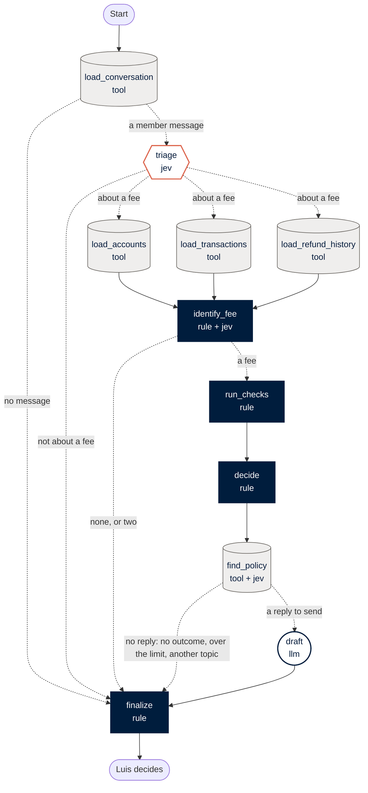

# Agent flow

<!-- Generated by `uv run python -m scripts.gen_agent_diagram` from the built graph,
the nodes' prompt versions and backend/core/config/. Edit the script, not this file:
a test fails when the two disagree. -->

Sequential, with one parallel fan-out (the three reads, joined at `identify_fee`).
Every path ends at `finalize`, and then with Luis: the graph only reads, and the
refund is his `POST /cases/{id}/decision`, which the graph can't reach.

Shapes: **tool**: Tool: reads the database as agent_reader · **jev**: Jev: a typed classification · **llm**: LLM: Sol writes text · **rule**: Rule: deterministic code.
Dotted edges are conditions.

## Nodes

| Node | Kind | What it does | Prompt | Tool calls | When it fails |
|---|---|---|---|---|---|
| `load_conversation` | tool | Reads the conversation since the last staff reply, sanitises and masks it | — | get_conversation, get_member_profile, list_account_numbers, get_last_known_language | `data_timeout`: Luis decides, with what was read |
| `triage` | jev | Intent, language, tone, manipulation and multiple requests, in one call | [`triage-v2`](../../backend/agents/prompts/triage-v2.yaml) | — | Luna answers instead (a note); if Luna fails too, `classifier_down`, and the message is treated as a possible fee request |
| `load_accounts` | tool | Sub-accounts, balances and standing | — | list_member_accounts | `data_timeout`: Luis decides, with what was read |
| `load_transactions` | tool | The last 30 days, in posting order | — | list_transactions | `data_timeout`: Luis decides, with what was read |
| `load_refund_history` | tool | Fee refunds of the last 400 days, the core's and ours | — | list_fee_refunds, list_our_refunds | `data_timeout`: Luis decides, with what was read |
| `identify_fee` | rule + jev | The fee the message is about: the only one, the one Luis picked, or Jev's choice between two | [`fee-choice-v1`](../../backend/agents/prompts/fee-choice-v1.yaml) | — | `fee_ambiguous`: Luis picks the fee and the case is checked again; no fee is `fee_not_found` |
| `run_checks` | rule | The policy rules: same-day deposit, yearly limit, standing, already refunded, balances that add up | — | — | — |
| `decide` | rule | Refund or not, the amount, and whether the case is clear (shadow mode) | — | — | — |
| `find_policy` | tool + jev | Full-text search for the clauses, then Jev confirms the one behind the decision | [`clause-choice-v1`](../../backend/agents/prompts/clause-choice-v1.yaml) | search_clauses | The deciding rule's own clause is quoted (never changes the outcome) |
| `draft` | llm | The reply, from the facts only (never the member's text), then a deterministic post-check | [`draft-v1`](../../backend/agents/prompts/draft-v1.md) | — | Asked again once (2 tries); then the template and `drafter_down` |
| `finalize` | rule | The status Luis sees, with every reason, and the result | — | — | — |

## Prompts

- [`triage-v2`](../../backend/agents/prompts/triage-v2.yaml): one Jev request with five typed questions about the masked message.
- [`fee-choice-v1`](../../backend/agents/prompts/fee-choice-v1.yaml): which of two fees the message means; the options are the fees, each named by the payment before it.
- [`clause-choice-v1`](../../backend/agents/prompts/clause-choice-v1.yaml): which searched clause is the rule behind the decision, given the case facts.
- [`draft-v1`](../../backend/agents/prompts/draft-v1.md): Sol's system prompt for the reply; it gets the outcome and facts, never the member's text.

## Fallback chains

- **Jev** (jev-1.13.0): 2 s, 2 retries with backoff 0.5 to 4 s. Triage then goes to **Luna** (gpt-6-luna): 8 s, 2 retries with backoff 0.5 to 4 s. If both fail: `classifier_down`. The fee and clause choices use Jev alone: a choice needs its calibrated confidence.
- **Sol** (gpt-6.1-sol): 20 s, 2 retries with backoff 0.5 to 4 s, then the template and `drafter_down`.
- **Reads**: 3 s each, 1 retry, then `data_timeout`.
- **The run**: 45 s in all. Every model call ends 3 s before that, so its fallback still fits.

## Handoffs to Luis

- **Every case.** The flow prepares and recommends; Luis approves, edits, rejects or replies only. Auto-approve exists in shadow mode only (off).
- **Needs your call.** Any doubt or failure: unclear intent, a fee question, two possible fees (he picks one, and the case is checked again with it), no fee, manipulation, more than one request, an unsupported language, a classifier, read or drafter failure, or balances that don't add up.
- **Needs supervisor approval.** A refund above his limit: no reply is drafted.
- **Not about a fee.** The early exit after triage: he answers it himself.
