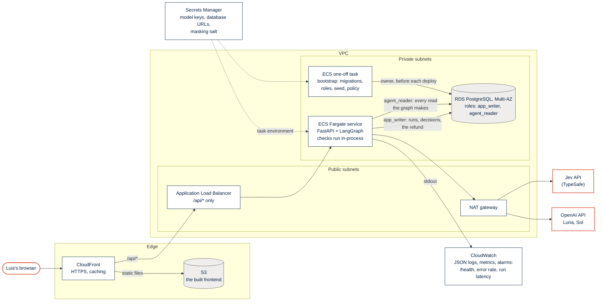

# System: the production target on AWS

The demo runs on one machine with Docker Compose. This is where the same containers would run in
production: the same two images, the same two database roles, and the same rule that the agent
only ever reads.

**Why this shape.**
- **One backend service.** A check is a few seconds of mostly waiting on the models, so it runs
  in-process (D-api-2) and streams its steps to the page over server-sent events through the
  ALB. A queue and workers would earn their place only with many staff checking at once.
- **Two roles in one database.** The ECS task gets both URLs: `agent_reader` for every read the
  graph makes, `app_writer` for runs, decisions and the refund. The owner credentials reach only
  the one-off bootstrap task.
- **Nothing public but CloudFront.** The ALB accepts traffic only from CloudFront, the tasks and
  the database live in private subnets, and the models are reached through the NAT gateway.
- **Secrets stay out of images.** Secrets Manager fills the task environment; the code reads
  environment variables only, as it does locally from `.env`.

## How the local stack maps to it

| Compose (`docker-compose.yml`) | AWS |
|---|---|
| `frontend`: nginx serves the build and proxies `/api` to the backend | CloudFront + S3, with `/api/*` routed to the ALB |
| `backend`: the FastAPI image on port 8000 | The ECS Fargate service behind the ALB |
| `migrate`: `python -m backend.bootstrap`, once per start | The ECS one-off task, once per deploy |
| `db`: Postgres 16 with a volume | RDS PostgreSQL, Multi-AZ, with the same two login roles |
| `.env` | Secrets Manager, injected as task environment variables |
| Logs on stdout (JSON lines) | CloudWatch Logs, with metrics and alarms on top |
| Calls from the backend container to Jev and OpenAI | The same calls, through the NAT gateway |

The demo deploy (Render, phase B in `SPEC-delivery.md`) is a smaller version of the same picture:
one web service per image and a managed Postgres.
